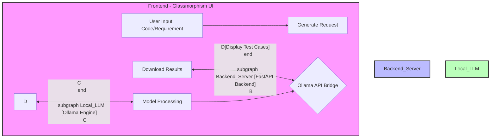

# AI Local Test Case Generator 🚀

A premium, localized AI tool that generates comprehensive test cases (Unit, Integration, and Edge cases) using local LLMs via Ollama. No data leaves your machine.

## 🌟 Overview

The **AI Local Test Case Generator** is designed for developers who need high-quality test suites without relying on cloud-based AI services. It leverages the power of **Ollama** models (like Mistral, Llama 3, or Codellama) to analyze your code and generate structured test cases instantly.

## 🏗 Architecture & Data Flow



## ✨ Features

- **Local Execution**: Complete privacy. Your source code never touches the internet.
- **Premium UI**: Modern glassmorphism design with fluid animations and syntax highlighting.
- **Multi-Model Support**: Works with any model installed in your Ollama library.
- **One-Click Export**: Download generated test cases as Markdown files.
- **Real-time Feedback**: Clean loading states and interactive response handling.

## 🛠 Tech Stack

- **Frontend**: Vanilla HTML5, CSS3 (Modern Flexbox/Grid), JavaScript (ES6+).
- **Backend**: FastAPI (Python), Uvicorn.
- **AI Engine**: Ollama (Running locally).
- **Styling**: Premium Custom CSS with Animations.

## 🚀 Getting Started

### Prerequisites

1.  **Ollama**: Install from [ollama.com](https://ollama.com/).
2.  **Python 3.8+**: Ensure Python is installed on your system.
3.  **Model**: Pull a coding model (e.g., `mistral` or `codellama`).
    ```bash
    ollama pull mistral
    ```

### Installation

1.  **Clone the repository**:
    ```bash
    git clone https://github.com/KrishnaKumar-commits/AI-Local-Test-case-Generator.git
    cd AI-Local-Test-case-Generator
    ```

2.  **Install Dependencies**:
    ```bash
    pip install fastapi uvicorn requests
    ```

### Running the App

Simply run the batch file:
```bash
run_app.bat
```
The application will be available at `http://127.0.0.0:8000`.

## 📁 Project Structure

- `backend/`: FastAPI logic and Ollama integration.
- `frontend/`: UI templates and static assets (CSS/JS).
- `run_app.bat`: Quick-start script for Windows.
- `silent_start.vbs`: Script for running the backend in the background.

## 📄 License

MIT License - feel free to use and modify for your own projects!
